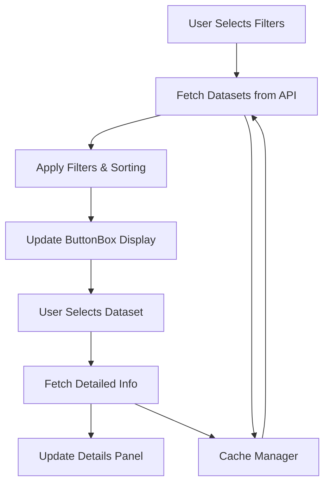

# HuggingFace Datasets Popularity Viewer - Design Document

## Overview
This document outlines the design and implementation plan for a Jupyter notebook widget that displays the most popular HuggingFace datasets based on download statistics, with filtering capabilities.

## Current State Analysis

### Existing Components
- **ButtonBox Widget**: A flexible widget for displaying selectable items with tooltips
- **Initial Prototype**: Basic implementation showing dataset authors
- **Dependencies**: `huggingface_hub`, `ipywidgets`, `pydoc`

### Current Limitations
- Only shows dataset authors, not actual datasets
- No download statistics or popularity ranking
- No filtering capabilities
- Limited dataset information display

## Requirements Analysis

### Functional Requirements
1. **Dataset Display**: Show most popular datasets based on downloads
2. **Time-based Filtering**: Last 7/30/90 days, all time
3. **Display Limits**: User-configurable (25/50/100 datasets)
4. **Dataset Details**: Description, stats, HuggingFace link on selection
5. **User Interface**: Intuitive filter controls + dataset selection

### Technical Requirements
1. **API Integration**: HuggingFace Hub API for dataset information
2. **Performance**: Efficient data fetching and caching
3. **Error Handling**: Graceful handling of API failures
4. **Responsive Design**: Clean, usable interface in Jupyter notebooks

## API Research Plan

### HuggingFace Hub API Capabilities
Need to investigate:

```python
# Key API endpoints and methods to research
from huggingface_hub import list_datasets, dataset_info

# Research questions:
# 1. What information is available in DatasetInfo objects?
# 2. Are download statistics accessible via the API?
# 3. Can we filter by date ranges or sort by popularity?
# 4. What are the rate limits and performance considerations?
```

### Dataset Information Structure
Expected available data:
- **Basic Info**: `id`, `author`, `description`, `tags`, `created_at`
- **Statistics**: Download counts, file sizes, number of files
- **Metadata**: License, task categories, language, dataset format

### API Limitations and Workarounds
Potential issues:
- Download statistics may not be directly available
- Filtering by time periods might require custom implementation
- Rate limiting for large dataset lists
- Need to implement caching for better performance

## User Interface Design

### Layout Structure

```
┌─────────────────────────────────────────────────────────────┐
│                    Filter Controls                          │
├─────────────────────────────────────────────────────────────┤
│ Time Period: [7 days] [30 days] [90 days] [All time]      │
│ Show: [25] [50] [100] datasets                             │
│ [Refresh Data] [Loading...]                                 │
├─────────────────────────────────────────────────────────────┤
│                    Dataset ButtonBox                       │
│ [dataset-1] [dataset-2] [dataset-3] [dataset-4] ...       │
│ [dataset-5] [dataset-6] [dataset-7] [dataset-8] ...       │
├─────────────────────────────────────────────────────────────┤
│                   Dataset Details Panel                    │
│ Name: [Selected Dataset Name]                              │
│ Downloads: [Statistics]                                     │
│ Description: [Full description...]                         │
│ Link: [View on HuggingFace] [Documentation]               │
└─────────────────────────────────────────────────────────────┘
```

### Widget Components

1. **Filter Controls**:
   - Radio buttons for time periods
   - Dropdown/buttons for display limits
   - Refresh button with loading indicator

2. **Dataset Display**:
   - Enhanced ButtonBox showing dataset names
   - Tooltips with basic info (author, downloads)
   - Color coding by popularity/category

3. **Details Panel**:
   - HTML widget for rich content display
   - Links to HuggingFace pages
   - Download statistics and metadata

## Implementation Architecture

### Data Flow



### Core Components

1. **DatasetManager Class**
   - Handles API calls and caching
   - Implements filtering and sorting logic
   - Manages rate limiting

2. **FilterControls Class**
   - Creates and manages filter widgets
   - Handles user interactions
   - Triggers data refresh

3. **DatasetViewer Class**
   - Main orchestrator class
   - Integrates all components
   - Manages state and updates

### Data Structures

```python
# Dataset information structure
DatasetInfo = {
    'id': str,
    'author': str, 
    'name': str,
    'description': str,
    'downloads': int,
    'downloads_7d': int,
    'downloads_30d': int,
    'downloads_90d': int,
    'created_at': datetime,
    'updated_at': datetime,
    'tags': List[str],
    'url': str,
    'size': int,
    'files_count': int
}
```

## Implementation Strategy

### Phase 1: API Research & Core Data
- Research HuggingFace Hub API capabilities
- Implement basic dataset fetching
- Create data structures and caching

### Phase 2: Filter Implementation
- Build time-based filtering logic
- Implement sorting by download counts
- Add display limit controls

### Phase 3: UI Integration
- Enhance existing ButtonBox for datasets
- Create filter control widgets
- Integrate with dataset display

### Phase 4: Details & Polish
- Implement dataset details panel
- Add loading indicators and error handling
- Performance optimization and testing

## Technical Considerations

### Performance Optimization
- **Caching Strategy**: Cache dataset lists and details
- **Lazy Loading**: Load details only when needed
- **Pagination**: Handle large dataset lists efficiently
- **Rate Limiting**: Respect API limits

### Error Handling
- Network connectivity issues
- API rate limiting
- Invalid dataset IDs
- Missing dataset information

### User Experience
- Clear loading indicators
- Informative error messages
- Responsive design
- Intuitive navigation

## Testing Strategy

### Test Cases
1. **Filter Functionality**: Each time period filter works correctly
2. **Display Limits**: 25/50/100 dataset limits function properly
3. **Dataset Selection**: Details display correctly for all datasets
4. **Error Scenarios**: Graceful handling of API failures
5. **Performance**: Acceptable loading times with caching

### Integration Testing
- Test with various network conditions
- Verify API compatibility across HuggingFace updates
- Cross-browser compatibility (if applicable)

## Success Criteria

### Functional Success
- [ ] Displays datasets sorted by download popularity
- [ ] Time-based filtering works (7/30/90 days, all time)
- [ ] Configurable display limits (25/50/100)
- [ ] Dataset details show on selection
- [ ] Direct links to HuggingFace pages

### Technical Success
- [ ] Efficient API usage with caching
- [ ] Responsive user interface
- [ ] Proper error handling
- [ ] Good performance (< 3s initial load)

### User Experience Success
- [ ] Intuitive and easy to use
- [ ] Clear visual feedback
- [ ] Useful dataset information
- [ ] Stable and reliable operation

## Next Steps

1. Complete API research to understand available data
2. Create proof-of-concept implementation
3. Iterate on design based on technical findings
4. Implement full solution with all requirements
5. Test and refine user experience

---

*This design document will be updated as implementation progresses and new requirements are discovered.*